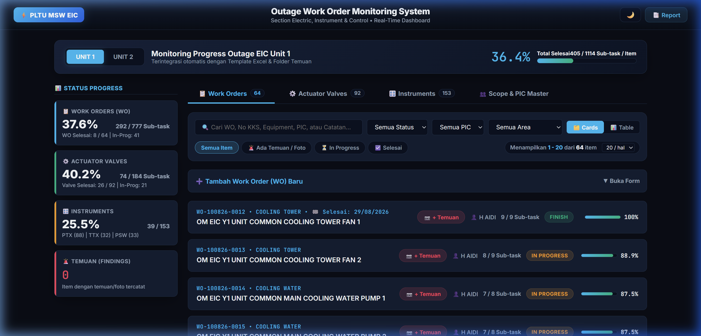
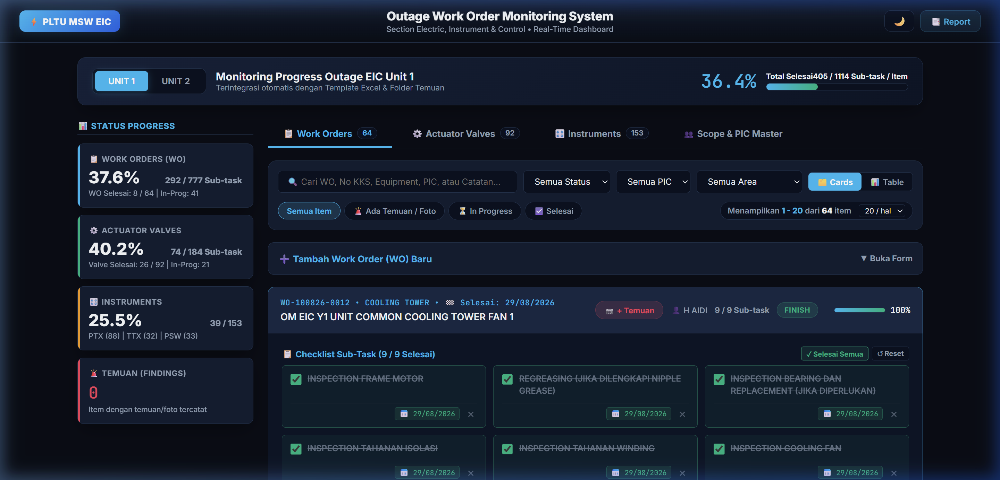
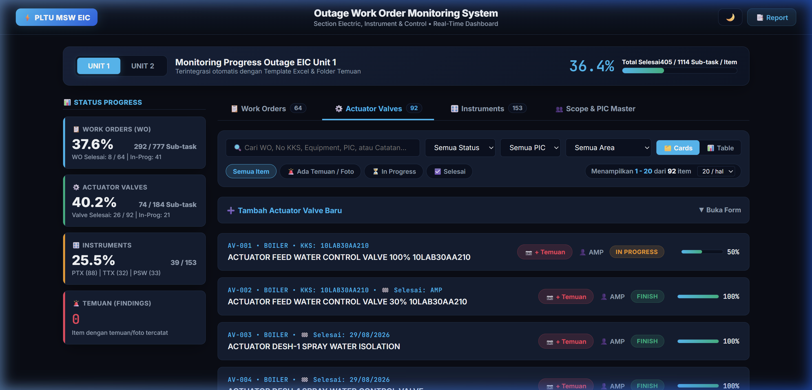
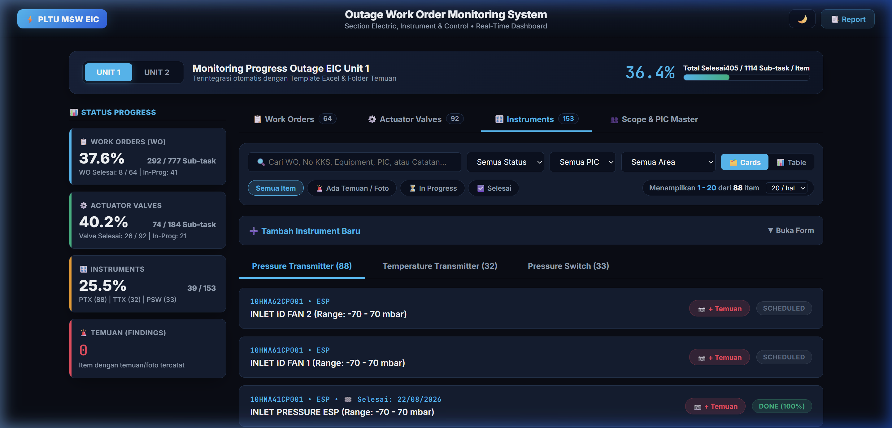
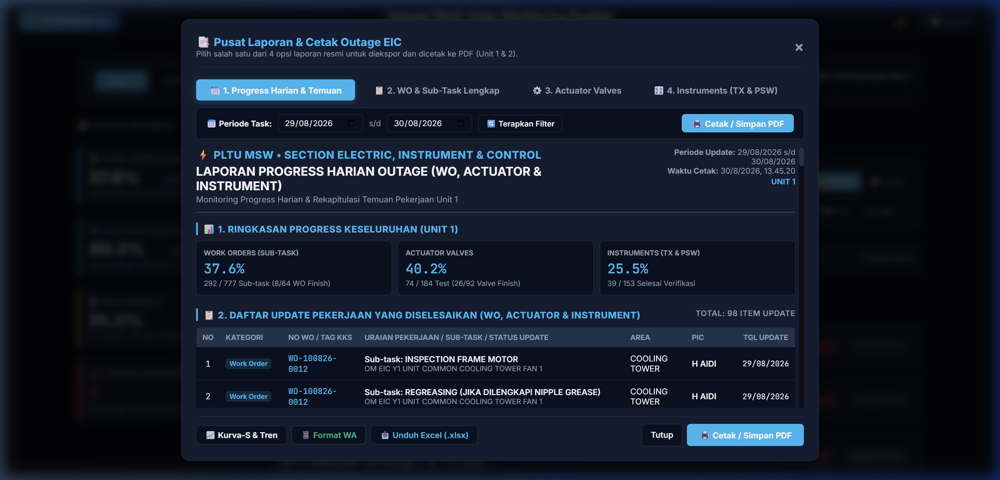
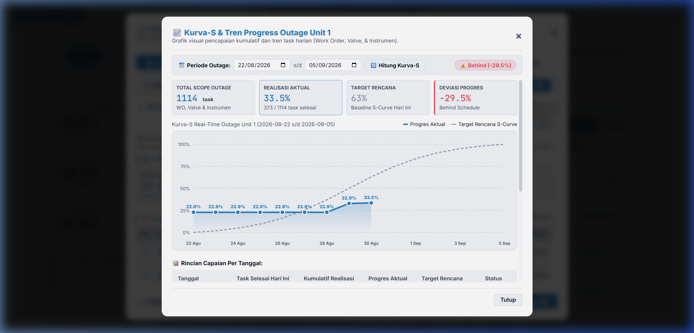
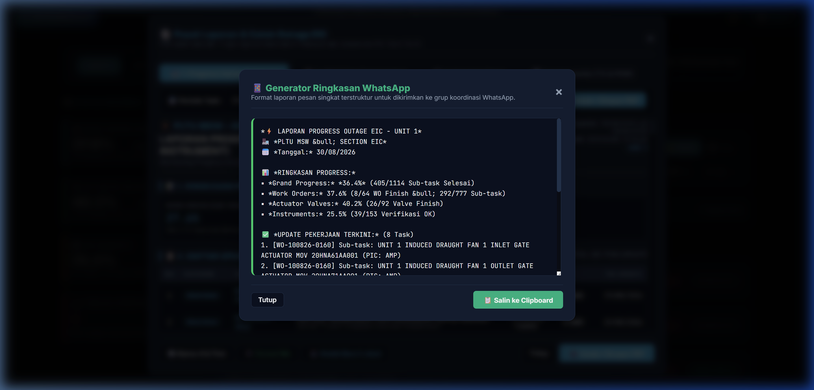
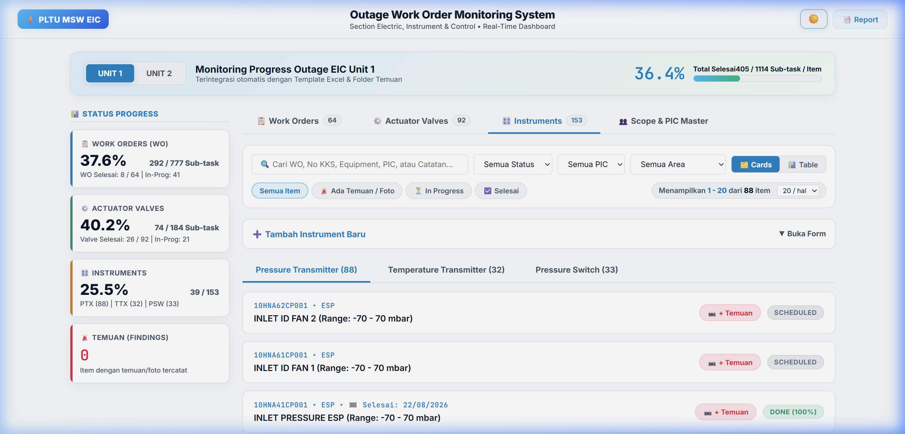

<div align="center">

# ⚡ PLTU MSW EIC Outage Monitoring System
### Real-Time Monitoring & Work Order Management Platform &bull; Unit 1 & Unit 2 (2 x 30MW)

[](https://www.python.org/)
[](https://github.com/)
[](https://github.com/)
[](https://github.com/)
[](https://github.com/)

<br />



</div>

---

## 📌 Daftar Isi (Table of Contents)
- [1. Pengantar & Latar Belakang](#-1-pengantar--latar-belakang-introduction)
- [2. Tujuan Sistem](#-2-tujuan-sistem-objectives)
- [3. Fitur Utama & Dokumentasi Visual](#-3-fitur-utama--dokumentasi-visual-key-features)
  - [3.1. Dashboard Real-Time & KPI Progress](#31-dashboard-real-time--kpi-progress)
  - [3.2. Manajemen Work Order & Batch Action](#32-manajemen-work-order--batch-action)
  - [3.3. Monitoring Actuator Valves](#33-monitoring-actuator-valves)
  - [3.4. Verifikasi & Kalibrasi Instrumen](#34-verifikasi--kalibrasi-instrumen)
  - [3.5. Pusat Laporan Resmi & Ekspor](#35-pusat-laporan-resmi--ekspor)
  - [3.6. Analisis Kurva-S & Tren Harian](#36-analisis-kurva-s--tren-harian)
  - [3.7. Generator Ringkasan WhatsApp](#37-generator-ringkasan-whatsapp)
  - [3.8. Dual Theme (Dark & Light Mode)](#38-dual-theme-dark--light-mode)
- [4. Struktur Direktori & Arsitektur](#-4-struktur-direktori--arsitektur-directory-structure)
- [5. Cara Menjalankan Aplikasi](#-5-cara-menjalankan-aplikasi-getting-started)
- [6. Protokol Sinkronisasi Data Excel](#-6-protokol-sinkronisasi-data-excel-sync-protocol)
- [7. Pemecahan Masalah & FAQ](#-7-pemecahan-masalah--faq-troubleshooting)

---

## 📖 1. Pengantar & Latar Belakang (Introduction)

**PLTU MSW EIC Outage Monitoring System** adalah platform pemantauan pekerjaan pemeliharaan berkala (*Overhaul / Outage*) berbasis web lokal yang dikembangkan khusus untuk **Section Electric, Instrument & Control (EIC) PLTU MSW (2 x 30MW)**.

Sistem ini memfasilitasi tim pemeliharaan dalam memantau, memperbarui, dan mendokumentasikan progres ratusan item pekerjaan lapangan (Work Order, Motorized Valve Actuator, serta Sensor Transmitter & Switch) secara real-time yang tersinkronisasi langsung secara dua arah (*two-way synchronization*) dengan master database spreadsheet Microsoft Excel (`Template_Outage_EIC_Monitoring_unit 1.xlsx` dan `unit 2.xlsx`).

---

## 🎯 2. Tujuan Sistem (Objectives)

1. **⚡ Visibilitas Real-Time:** Memberikan gambaran akurat mengenai persentase progres harian (*Grand Total, WO, Valve, & Instrumen*) tanpa perlu rekap manual.
2. **🔄 Sinkronisasi 2-Arah Otomatis:** Perubahan checklist di web langsung tersimpan ke Excel, dan sebaliknya data master Excel terbaca dinamis oleh sistem.
3. **📷 Digitalisasi Bukti Lapangan (*Paperless*):** Mendukung unggah multi-foto bukti temuan, pencatatan anomali (*abnormal findings*), dan rencana tindak lanjut perbaikan.
4. **📊 Pelaporan Standar Industri:** Menyediakan 4 opsi laporan resmi berformat cetak PDF, ekspor spreadsheet `.xlsx` instan, serta ringkasan pesan koordinasi harian format WhatsApp.

---

## 🚀 3. Fitur Utama & Dokumentasi Visual (Key Features)

### 3.1. Dashboard Real-Time & KPI Progress
Menyajikan matriks pencapaian outage dengan kartu ringkasan KPI otomatis.

<div align="center">
  
</div>

- **Progress Banner:** Menampilkan persentase pencapaian total (*Huge Metric*), rasio task selesai, dan tombol pemilih unit (**UNIT 1** / **UNIT 2**).
- **KPI Metrik Vertikal:**
  - 📋 **Work Order:** Total WO selesai dan rasio sub-task selesai.
  - ⚙️ **Actuator Valves:** Status kesiapan General Inspection & Function Test.
  - 🎛️ **Instruments:** Status verifikasi Pressure TX, Temperature TX, & Pressure Switch.
  - 🚨 **Temuan Lapangan:** Menghitung jumlah anomali aktif yang memerlukan penanganan.

---

### 3.2. Manajemen Work Order & Batch Action
Setiap kartu WO memuat deskripsi pekerjaan, area pembangkit, PIC pelaksana, dan checklist sub-task interaktif.

<div align="center">
  
</div>

- **⚡ Batch / Bulk Action:**
  - **`✓ Selesai Semua`**: Mencentang seluruh sub-task sekaligus, mengisi tanggal hari ini, dan menaikkan status WO langsung menjadi **100% FINISH**.
  - **`↺ Reset`**: Mengosongkan seluruh centang checklist untuk peninjauan ulang.
- **➕ Tambah Sub-Task Fleksibel:** Mendukung input deskripsi *Manual*, memilih dari *Master Actuator*, atau memilih dari *Master Instrument*.
- **📅 Auto-Fill Tanggal Selesai:** Tanggal selesai otomatis terisi saat seluruh checklist terpenuhi dan otomatis terhapus jika belum tuntas.

---

### 3.3. Monitoring Actuator Valves
Memantau seluruh motorized actuator valve di area Boiler, Turbine, dan Auxiliary.

<div align="center">
  
</div>

- **Checklist Inspeksi Independen:** Pemeriksaan terpisah untuk *General Inspection* (Fisik/Mekanis/Elektrikal) dan *Function Test* (Uji Buka/Tutup & Sinyal DCS).
- **Mode Matriks Komparasi:** Memungkinkan pembandingan kesiapan actuator antara Unit 1 dan Unit 2 berdampingan.

---

### 3.4. Verifikasi & Kalibrasi Instrumen
Monitoring instrumentasi pembangkit yang dikelompokkan ke dalam sub-tab khusus:
- **Pressure Transmitter (PTX)**
- **Temperature Transmitter (TTX)**
- **Pressure Switch (PSW)**

<div align="center">
  
</div>

---

### 3.5. Pusat Laporan Resmi & Ekspor
Akses terpadu dari tombol **`📑 Report`** di header yang menyediakan 4 format laporan standar:

<div align="center">
  
</div>

1. **Laporan 1: Progress Harian & Temuan:** Rekapitulasi progres sub-task yang diselesaikan pada rentang tanggal tertentu beserta daftar temuan aktif.
2. **Laporan 2: WO & Sub-Task Lengkap:** Rincian seluruh Work Order beserta rincian sub-task dan PIC.
3. **Laporan 3: Actuator Valves:** Matriks status inspeksi seluruh aktuator.
4. **Laporan 4: Instruments:** Rekap verifikasi instrumen PTX, TTX, dan PSW.
5. **📥 Unduh Excel (.xlsx):** Mengunduh live database Excel termutakhir langsung dari browser.
6. **🖨️ Cetak / Simpan PDF:** Format cetak resmi berstandar dokumen operasional.

---

### 3.6. Analisis Kurva-S & Tren Harian
Grafik visualisasi kurva-S interaktif untuk menganalisis kecepatan pencapaian aktual harian terhadap target rencana penyelesaian outage.

<div align="center">
  
</div>

---

### 3.7. Generator Ringkasan WhatsApp
Fitur pembuatan teks laporan ringkas harian otomatis yang terstruktur rapi untuk dibagikan ke grup koordinasi WhatsApp.

<div align="center">
  
</div>

- Dilengkapi tombol 1-klik **"📋 Salin ke Clipboard"**.

---

### 3.8. Dual Theme (Dark & Light Mode)
Antarmuka mendukung pergantian tema gelap dan terang dengan tombol switch ikon di pojok kanan atas header.

<div align="center">
  
</div>

---

## 📁 4. Struktur Direktori & Arsitektur (Directory Structure)

```plaintext
d:\msw\msw_eic_om\
├── server.py                                    # Backend HTTP Server, JSON API, & Embedded UI Template
├── server.exe                                   # Standalone Binary Application (Tanpa instalasi Python)
├── server.spec                                  # Konfigurasi Build PyInstaller
├── start_app.bat                                # Skrip Launcher Cepat
├── .gitignore                                   # Konfigurasi Git Ignore
├── README.md                                    # Dokumentasi Utama Repositori (GitHub Format)
├── Template_Outage_EIC_Monitoring_unit 1.xlsx   # Database Master Unit 1
├── Template_Outage_EIC_Monitoring_unit 2.xlsx   # Database Master Unit 2
├── Finding/                                     # Penyimpanan Foto & Bukti Temuan Lapangan
│   ├── UNIT 1/
│   └── UNIT 2/
└── screenshots/                                 # Tangkapan Layar Dokumentasi Sistem
    ├── dashboard_dark.png
    ├── work_order_expanded.png
    ├── actuator_valves_tab.png
    ├── instruments_tab.png
    ├── report_modal.png
    ├── s_curve_graph.png
    ├── whatsapp_format.png
    └── light_mode.png
```

---

## 🛠️ 5. Cara Menjalankan Aplikasi (Getting Started)

<details open>
<summary><b>🔹 Opsi 1: Menjalankan Binary Mandiri (Rekomendasi untuk User/Teknisi)</b></summary>

Cukup klik ganda (*double-click*) file:
```plaintext
server.exe
```
Aplikasi akan langsung menyalakan server lokal pada port 8000 dan membuka dashboard di browser default:
```plaintext
http://localhost:8000
```
</details>

<details>
<summary><b>🔹 Opsi 2: Menjalankan via Batch File Launcher</b></summary>

Klik ganda file:
```plaintext
start_app.bat
```
</details>

<details>
<summary><b>🔹 Opsi 3: Menjalankan dari Source Code Python (Development)</b></summary>

1. Pastikan dependensi Python terpasang:
   ```bash
   pip install openpyxl pillow
   ```
2. Jalankan server:
   ```bash
   python server.py
   ```
</details>

<details>
<summary><b>🔹 Opsi 4: Mengompilasi Ulang ke Executable (.exe)</b></summary>

Jika Anda melakukan perubahan pada `server.py`, lakukan kompilasi ulang dengan perintah:
```powershell
pyinstaller server.spec --distpath . -y
```
</details>

---

## 🔄 6. Protokol Sinkronisasi Data Excel (Sync Protocol)

Sistem menggunakan mekanisme penguncian file aman (*Thread-Safe File Lock*) untuk menjamin konsistensi data:

| Lembar Kerja (Sheet) | Data yang Disimpan | Mekanisme Sinkronisasi |
| :--- | :--- | :--- |
| **`WorkOrder`** | No WO, Deskripsi, Area, PIC, Status, % Progress, Tanggal Finish, Remarks | Diperbarui otomatis saat checklist sub-task dicentang. |
| **`WorkOrder_Checklist`** | Sub-task WO, PIC Task, Status Selesai (TRUE/FALSE), Tanggal | Sinkronisasi dua arah real-time dengan Actuator & Instrument. |
| **`ActuatorValve`** | Equipment ID, Area, KKS, General Inspection, Function Test, Status | Otomatis tersinkronisasi saat sub-task actuator di WO dicentang. |
| **`Instrument_*`** | No, Tag KKS, Equipment, Range, Status Kalibrasi & Verifikasi | Otomatis tersinkronisasi saat sub-task instrumen di WO dicentang. |

---

## 💡 7. Pemecahan Masalah & FAQ (Troubleshooting)

<details>
<summary><b>❓ Bagaimana cara mengakses dashboard dari smartphone / laptop lain di jaringan LAN?</b></summary>

1. Pastikan kedua perangkat terhubung ke jaringan WiFi/LAN yang sama dengan komputer server.
2. Cari IP komputer server (misal: `192.168.1.50`).
3. Buka browser di smartphone/laptop klien dan kunjungi:
   ```plaintext
   http://192.168.1.50:8000
   ```
</details>

<details>
<summary><b>❓ Muncul pesan error "File Excel sedang terkunci" saat menyimpan:</b></summary>

Tutup file Excel `Template_Outage_EIC_Monitoring_unit X.xlsx` jika sedang dibuka di aplikasi Microsoft Excel desktop agar server dapat menulis data perubahan secara bebas.
</details>

<details>
<summary><b>❓ Bagaimana cara me-refresh data tanpa menutup browser?</b></summary>

Cukup klik badge logo **`⚡ PLTU MSW EIC`** di pojok kiri atas header atau tekan tombol keyboard **Ctrl + F5**.
</details>

---

<div align="center">

**PLTU MSW &bull; Section Electric, Instrument & Control (EIC)**  
*Continuous Improvement &bull; Excellence in Plant Reliability & Safety*

</div>
